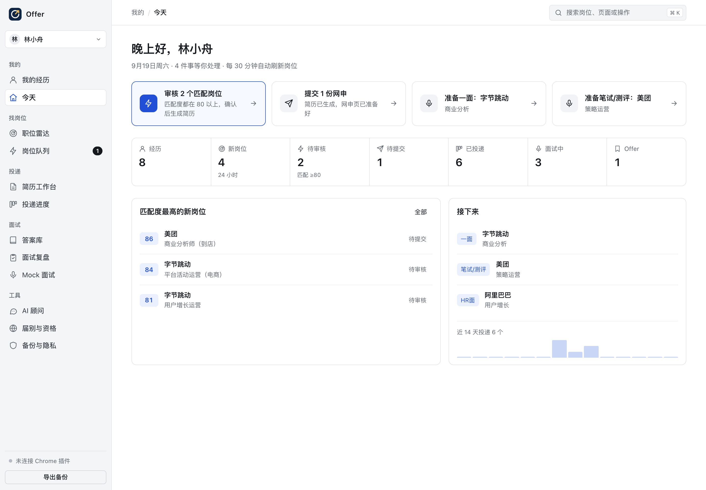
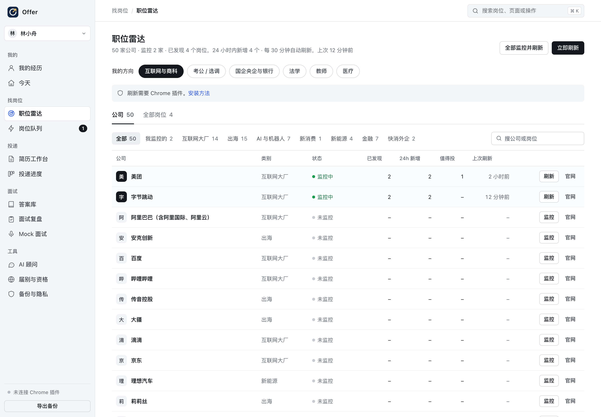
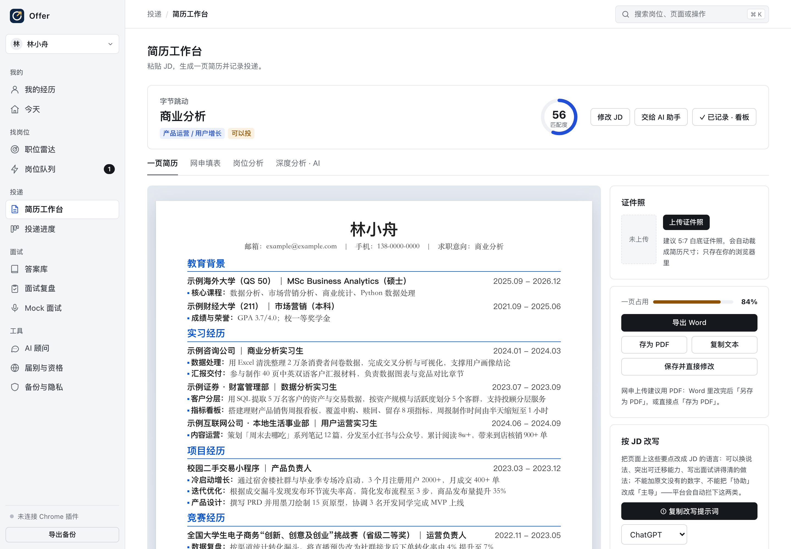
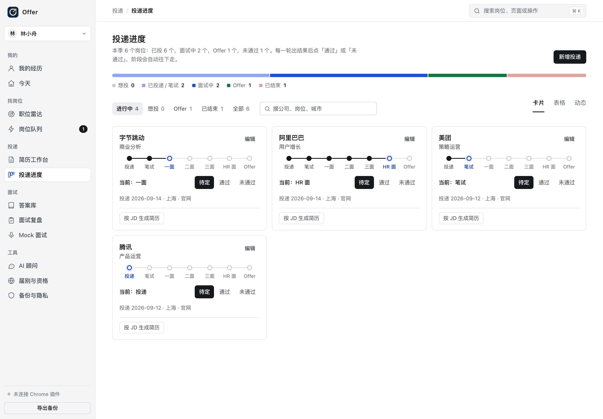
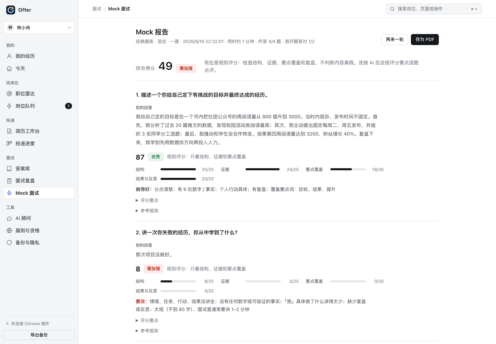

# Offer · 校园招聘工作台

[](https://github.com/dontworrybeharry/offer/actions/workflows/ci.yml)

Offer 把校招求职的全流程放进一个本地优先的工作台：整理经历、发现岗位、按 JD 生成一页简历、跟踪投递进度、准备面试。数据默认只保存在你自己的设备上，投递始终由你本人确认提交。



## 核心能力

| 模块 | 说明 |
| --- | --- |
| 我的经历 | 结构化录入教育、实习、项目、竞赛和校园经历；支持整段粘贴旧简历导入。要点缺少结果、过长或以「协助」开头时给出提示。 |
| 职位雷达 | 内置 50+ 家校招官网来源，按求职方向（互联网与商科、考公 / 选调、国企央企与银行、法学、教师、医疗）筛选；一键监控并刷新。飞书招聘、北森、腾讯、快手、网易、米哈游、蚂蚁、TikTok 等招聘系统由本机后端直接读取岗位与 JD（无需插件，数百个岗位约半分钟），其余官网由 Chrome 插件读取。 |
| 岗位队列 | 新岗位先经过规则筛选（关键词、城市、届别窗口、匹配度），再由你审核；确认后按该岗位 JD 生成简历，并在 Chrome 中打开网申页自动填写。 |
| 简历工作台 | 解析 JD 的岗位方向与能力要求，从经历中取舍要点，按 A4 实测排版保证一页；可导出 Word / PDF。改写建议会拦截原文没有的数字和职责拔高。 |
| 投递进度 | 卡片、表格、动态三种视图；每一轮标记「通过 / 未通过 / 待定」，阶段自动推进；投递时冻结当时使用的简历版本，便于事后对照。 |
| 面试准备 | 素材库（每段经历的 60 秒口播、深挖与追问）、答案库、面试复盘（失分原因统计）、Mock 面试（带评分要点的题库，提交后自动评分，可接入大模型逐题点评）。 |
| 届别与资格 | 按求职方向列出时间节奏、所需材料和投递前核对清单；按学位授予日期判断各公司的届别窗口。 |
| 多档案 | 侧栏切换档案，每个人的数据独立存储；新建档案空白起步，可导入自己的经历。 |
| AI 顾问 | 可选。填入任意兼容 OpenAI 接口的服务（如硅基流动、OpenRouter、本机 Ollama），用于岗位判断、简历改写、开放题写作和模拟面试。 |

<table>
<tr><td></td><td></td></tr>
<tr><td></td><td></td></tr>
</table>

## 设计原则

- **本地优先**：数据保存在浏览器或本机数据库，不经过任何第三方服务器。
- **人来决定**：平台负责找岗位、筛选、生成材料和填表，从不替你点击「提交」，不处理验证码，不代为登录。
- **不编造**：简历只使用你录入过的经历和数字；缺少证据的 JD 要求会明确标为缺口。
- **来源可核验**：届别口径、招聘节奏等信息附来源或标注「以官方公告为准」。

## 快速开始

### 方式一：直接打开（无需安装）

下载仓库后，用 Chrome、Edge 或 Safari 打开 `index.html` 即可使用。首次可点「载入示例」查看虚构示例同学的完整数据。

### 方式二：本机后端（推荐）

后端基于 FastAPI + SQLite，只监听本机地址。启动后在浏览器打开 <http://127.0.0.1:8765/>：多个窗口与浏览器共享同一份数据并实时同步，大模型 API Key 保存在本机数据库。

```bash
sh backend/run.sh
```

首次运行会自动创建虚拟环境并安装依赖（需要 Python 3.10+）。接口文档：<http://127.0.0.1:8765/docs>。详见 [backend/README.md](backend/README.md)。

### 方式三：Chrome 插件（自动收集岗位、填写网申）

1. 打开 `chrome://extensions`，开启「开发者模式」。
2. 点击「加载已解压的扩展程序」，选择仓库中的 `extension` 文件夹。
3. 在 Offer 中看到「Chrome 插件已连接」即可使用职位雷达的刷新和岗位队列的网申填写。

## 架构

```
浏览器页面 (index.html)
  ├─ 离线模式：数据存 localStorage
  └─ 在线模式：页面由本机后端提供 ──► FastAPI (127.0.0.1:8765)
                                        ├─ /api/state   整份状态同步（版本号 + 冲突检测）
                                        ├─ /api/events  实时事件（SSE），多窗口同步
                                        ├─ /api/applications · jobs · sources · resumes
                                        ├─ /api/jobs/fetch  直接读取招聘系统公开接口（飞书招聘 / 北森 / 腾讯 / 快手 / 网易 / 米哈游 / 蚂蚁 / TikTok）
                                        └─ /api/ai/*    大模型代理，Key 存本机 SQLite
Chrome 插件 (extension/)
  ├─ 后台打开招聘列表页，收集岗位并读取 JD
  └─ 在网申页按档案自动填写（不提交）
```

## 项目结构

```
index.html          完整的前端应用（单文件，可离线运行）
src/                前端功能模块源码（导航与设计系统、职位雷达、岗位队列、投递进度、Mock 评分、AI 顾问、多档案……）
tools/build.py      把 src/ 写回 index.html
sites.json          招聘来源库：公司、类别、列表页、是否支持自动收集
extension/          Chrome 插件（Manifest V3）
backend/            FastAPI 后端：app/ 源码，tests/ 测试，run.sh 启动脚本
docs/               ARCHITECTURE.md 架构说明 · DESIGN.md 设计规范 · screenshots/ 截图（均为虚构示例数据）
```

前端、后端、插件怎么连接，数据怎么流动，AI 负责什么，详见 [docs/ARCHITECTURE.md](docs/ARCHITECTURE.md)。

## 开发与测试

前端：修改 `src/` 下的模块后运行 `python3 tools/build.py`，刷新页面即可。提交前跑一次自检：

```bash
pip install esprima && python3 tools/check.py
```

自检会验证：每个模块能正确解析、模块之间没有重名的顶层函数（重名会互相覆盖）、`index.html` 与 `src/` 一致、仓库里没有个人信息。

后端（测试 · 代码风格 · 类型检查）：

```bash
cd backend
python3 -m venv .venv && .venv/bin/pip install -r requirements-dev.txt
.venv/bin/python -m pytest -q && .venv/bin/ruff check app tests && .venv/bin/mypy
```

以上检查每次推送都会在 GitHub Actions 上自动跑一遍（`.github/workflows/ci.yml`）。

更新招聘来源：编辑 `sites.json`（`co` 公司、`cat` 类别、`url` 列表页、`auto` 是否实测可自动收集），推送后使用者的来源库会在一天内自动更新。

## 已知限制

- 后端直读只使用招聘网站页面本身调用的公开接口；对接口做了加密或签名的系统（如 Moka、字节跳动）不做破解，改由 Chrome 插件像访客一样读取页面。
- 其余部分官网需要先选择招聘项目、岗位类别或登录后才显示岗位，这类来源标记为「需手动选类别」，需要在官网筛选后粘贴列表页地址。
- 政府、银行、医院等网站多以公告形式发布招聘信息，目前只提供官网入口与核对清单，不做自动收集。
- Mock 面试的规则评分只检查回答的结构、证据和要点覆盖，不判断内容真实性；接入大模型后可获得逐题点评。
- 一页简历按字宽测量排版，导出 Word 后建议在 Word 中确认页数。

## 隐私

- 离线模式下数据只存在浏览器 localStorage；使用本机后端时存在 `backend/data/`（已在 `.gitignore` 中排除）。
- 使用 AI 顾问时，对话内容会发送给你配置的模型服务商。
- Chrome 插件只在刷新岗位或填写网申时工作，数据保存在本机。

## 关于这个项目

Offer 是我在 2026 年秋招期间为自己做的求职工具（2026.08 起），以 Vibe Coding 的方式完成：我负责产品定义、需求拆解、交互设计和逐项验收，与 AI 编程助手协作实现代码。

它解决的是我自己遇到的问题：岗位分散在几十个官网，每个 JD 都要改一版简历，投了哪些岗位、用的是哪一版简历记不清，面试准备练了也没有反馈。

几个关键的产品决策：

- **人做最后决定**：平台可以找岗位、筛选、生成简历、填写网申，但提交永远由本人点击。
- **匹配度 80 分门槛**：岗位多了反而是负担，经历与 JD 匹配度不到 80 的岗位不进入待审核。
- **简历不编造**：只使用档案里真实写过的经历；口径不一致的地方标成「待确认」，由本人确认后再用。
- **投递时冻结简历**：简历会一直改，所以每条投递记录都保存当时实际投出去的那一版。
- **面试练习要有评分**：Mock 面试按评分要点给分并指出缺什么，而不是只让自己打星。
- **不止商科**：同一套流程覆盖考公、国企银行、法学、教师、医疗等方向，并支持多人各自建档。
- **只读公开数据**：读取招聘网站只用页面本身公开的接口，不破解加密、不绕过验证码。

## License

[MIT](LICENSE)
