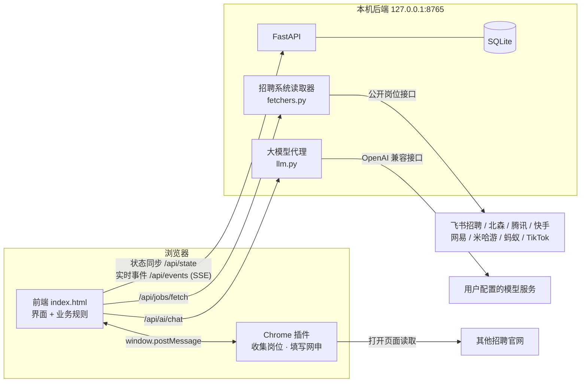
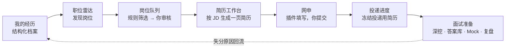

# Offer 架构说明

本文说明 Offer 由哪几部分组成、各部分怎么连接、数据怎么流动，以及 AI 在系统里负责什么、不负责什么。

## 1. 总览

Offer 由三部分组成，全部运行在使用者自己的电脑上：

| 部分 | 技术 | 职责 |
| --- | --- | --- |
| 前端 `index.html` + `src/` | 原生 JavaScript，单文件应用，无框架、无构建依赖 | 全部界面与业务规则：经历档案、JD 分析、一页简历排版、筛选打分、投递进度、面试模块 |
| 本机后端 `backend/` | Python · FastAPI · SQLAlchemy · SQLite | 数据持久化与多窗口同步、直接读取招聘系统接口、大模型代理（保管 API Key） |
| Chrome 插件 `extension/` | Manifest V3 | 打开无法直读的招聘网站收集岗位、读取 JD；在网申页按档案自动填写（从不提交） |

前端可以脱离后端单独运行（双击 `index.html`，数据存在 localStorage）；由后端提供页面时，同一份数据在所有浏览器和窗口之间实时同步，并启用后端直读和大模型代理。

## 2. 核心流程

1. **经历档案**：每段经历拆成可独立取用的要点（小标题 + 内容 + 适用条件），并附面试深挖（60 秒讲法、追问、关键事实与来源）。
2. **发现岗位**：能直读的招聘系统由后端调用公开接口拿到岗位和 JD；其余网站由插件在后台标签页打开读取。已读过的岗位按网址去重。
3. **筛选**：排除词、关注词、城市、届别窗口、求职方向，以及经历与 JD 的匹配度。匹配度低于 80 的岗位不进入待审核。
4. **生成简历**：解析 JD 的岗位方向与能力要求，给每条要点打相关度分，按 A4 实测排版保证一页；装不下时按优先级删减并列出删掉了什么。
5. **投递**：插件打开网申页、按档案填写；识别到「投递成功」后记入投递进度，并把当时使用的简历完整冻结保存。
6. **面试**：Mock 面试按评分要点自动打分，复盘统计失分原因，弱项回到经历深挖里补。

## 3. 前端

- **单文件**：`index.html` 包含应用骨架、简历引擎和全部模块，下载即可离线运行，也可直接部署到 GitHub Pages。
- **模块**：功能模块的源码在 `src/`，在 `index.html` 里以 `/*@QZ:模块名*/ … /*@/QZ:模块名*/` 标记包裹。修改后运行 `python3 tools/build.py` 写回。

| 模块 | 内容 |
| --- | --- |
| `shell.js` / `shell.css` | 导航、命令面板（⌘K）、顶栏、设计系统（颜色、字号、组件） |
| `profiles.js` | 多档案：每个档案独立的存储键和后端档案 |
| `api.js` | 与后端的状态同步：版本号冲突检测、SSE 实时刷新 |
| `radar.js` | 职位雷达：来源库、监控、刷新、岗位表 |
| `autopilot.js` | 岗位队列：收集 → 筛选打分 → 待审核 → 生成简历 → 网申；后端直读与插件两条收集路径 |
| `apps.js` | 投递进度：卡片 / 表格 / 动态视图，阶段与每轮结果，简历冻结 |
| `mock.js` | Mock 面试题库与自动评分 |
| `share/interview.js` | 答案库、面试复盘、面试深挖 |
| `agent.js` | AI 顾问（见第 6 节） |
| `dirs.js` / `sites.js` | 求职方向（商科、考公、国企银行、法学、教师、医疗）与来源库 |
| `page-tools.js` | 插件注入招聘页面的读取与填写函数 |

- **状态**：整份应用状态是一个对象 `S`，每次修改后写入 localStorage；连上后端时在 0.6 秒内同步到后端，其他窗口通过 SSE 收到更新并刷新。

## 4. 后端

`backend/app/`：

| 文件 | 内容 |
| --- | --- |
| `main.py` | 应用入口：页面路由、中间件（只接受本机 Host，防 DNS rebinding；CORS 只放行本机页面和插件） |
| `routers/state.py` | `GET/PUT /api/state`：整份状态读写，带版本号，冲突返回 409；`/api/state/export` 导出 |
| `routers/resources.py` | 投递、岗位、来源、简历版本的 REST 接口；`POST /api/jobs/import` 批量导入并去重 |
| `routers/misc.py` | 健康检查、SSE 事件、来源库、大模型代理、`/api/jobs/fetch` 直读 |
| `services/fetchers.py` | 招聘系统读取器：输入公司招聘页网址，识别所属系统，调用该系统页面本身使用的公开接口，统一输出岗位与 JD |
| `services/llm.py` | 大模型调用：Anthropic 与所有 OpenAI 兼容服务，支持工具调用；地址缺 `/v1` 时自动补全 |
| `services/state_sync.py` / `events.py` | 状态拆分存储与事件广播 |
| `models.py` | 表：workspaces、documents、applications、jobs、sources、resume_versions、secrets |

**直读的边界**：只使用招聘网站页面自己调用的公开接口，不登录、不绕过验证码。接口做了加密或签名的系统（Moka、字节跳动）以及有风控或防火墙的网站（携程、华为）不做破解，改由插件像访客一样读取页面。

质量保障：`backend/tests/` 16 项测试（状态同步与冲突、资源接口、导入去重、直读识别与解析、CORS 与 Host 限制、AI Key 脱敏等）；ruff 检查代码风格，mypy 做静态类型检查；`tools/check.py` 检查前端模块的语法、重名、构建一致性和隐私。全部在 GitHub Actions 上自动运行。

## 5. Chrome 插件

- `background.js`：命令 `scan`（打开列表页收集岗位链接）、`extract`（读取岗位详情）、`prepare`（打开网申页并附上简历）、`schedule`（定时刷新）、`focus` / `notify` / `done`。
- `bridge.js`：内容脚本，在 Offer 页面与插件之间用 `postMessage` 转发命令。
- `page-tools.js`：注入招聘页面的函数：识别岗位链接、读取 JD、按字段标签填写网申表单。
- 后台标签页注入可见性修正，保证单页应用在后台也能渲染出岗位列表。
- **不点击提交、不处理验证码、不代为登录**；遇到登录或验证码时停下来交给用户。

## 6. AI 的定位

Offer 的核心流程（找岗位、筛选、打分、排版简历、填表）全部由确定性的规则完成，不依赖 AI，结果可复现。AI 只用在需要判断和写作的环节，并且是可选的。

| 位置 | AI 做什么 | 约束 |
| --- | --- | --- |
| AI 顾问（`agent.js`） | 一个带工具调用的对话代理。可用工具：`get_profile`、`analyze_jd`、`build_resume`、`rewrite_resume_bullets`、`get_application_fields`、`list_applications`、`save_application`、`save_note`、`check_eligibility`、`list_resume_history`、`autopilot_status`、`autopilot_run` | 工具只能读写平台自己的数据；改写简历要点时，出现原文没有的数字或把「协助」改成「主导」会被拦截 |
| 岗位队列（可选） | 对通过规则筛选的岗位再判断一次值不值得投，写网申「为什么投递」 | 只根据档案里真实存在的经历；不替用户投递 |
| Mock 面试（可选） | 按评分要点逐题点评：答到了什么、缺什么、怎么改 | 未连接 AI 时使用规则评分（结构、证据、要点覆盖、复盘） |

模型由用户自己配置（任何兼容 OpenAI 接口的服务或本机 Ollama）。连接后端时 Key 保存在本机数据库，由后端代理调用，不进入浏览器同步的数据。

## 7. 隐私与安全

- 数据只在本机：localStorage 或 `backend/data/`（不进入版本库）。
- 后端只监听 127.0.0.1，校验 Host，CORS 只放行本机页面和插件扩展 ID 格式。
- API Key 不写入备份文件，不随状态同步。
- 多档案之间存储键与后端档案完全隔离。

## 8. 开发方式

本项目以 Vibe Coding 的方式完成：作者负责产品定义、需求拆解、交互与验收，与 AI 编程助手（Claude）协作实现代码。每个功能都经过真实数据测试：用无头 Chrome 驱动页面做端到端测试，实际请求各招聘系统验证直读结果，后端有单元测试。
